# （超详细）标准C语言实现简单Web服务器


本课设任务来自**长江大学**计算机网络课设任务四！

运行环境是**Visual studio 2022** !

其他的环境请自行测试

**gitee仓库**里面的这个你不需要额外下载，代码包就是仓库里面的文件

## 一、任务要求


**设计目标：**

完成基础的tcp连接，支持基础的client与其连接 使用fork()来支持并发访问服务器 简单的http访问，支持静态页面访问 支持静态页面访问，需要一定的报错机制，如404页面的建立。

1. socket实现简单Http服务器，完成html的解析；

2. 运行该服务器可以通过浏览器访问服务器目录下的  Html文件、jpg图片、css文件的载入。 完成初步的Http服务器功能。

**相关技术：**

Server端:

1.完成socket(),bind(),listen()这些初始化工作后，调用accept()方法阻塞等待(其实就是进入一个死循环),等待CLient的connect()方法连接 Client端: 

2.先调用socket(),然后调用connect()想要与Server端进行连接，这个时候就会进行传说中的TCP三次握手，也就是在Client 发起connect()，并且Server进入accept()阻塞等待时发生三次握手

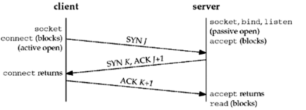


## 二、运行截图


 **终端运行截图**：

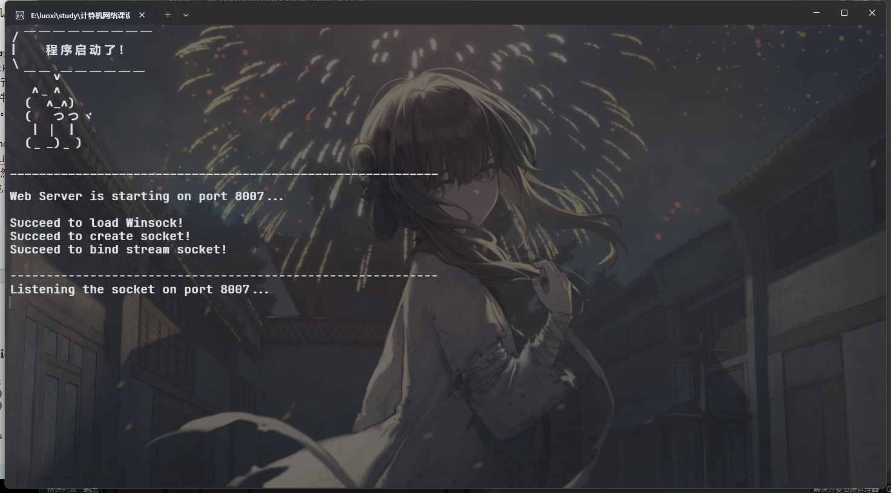

**代码实现效果**：

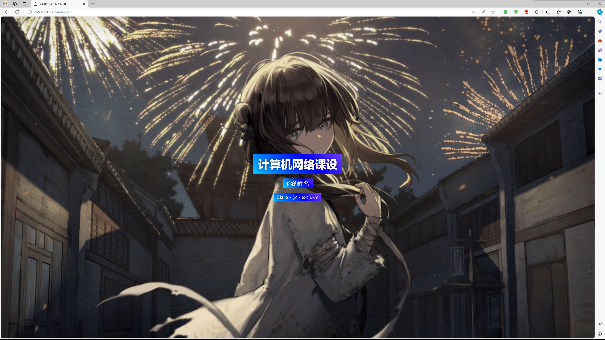

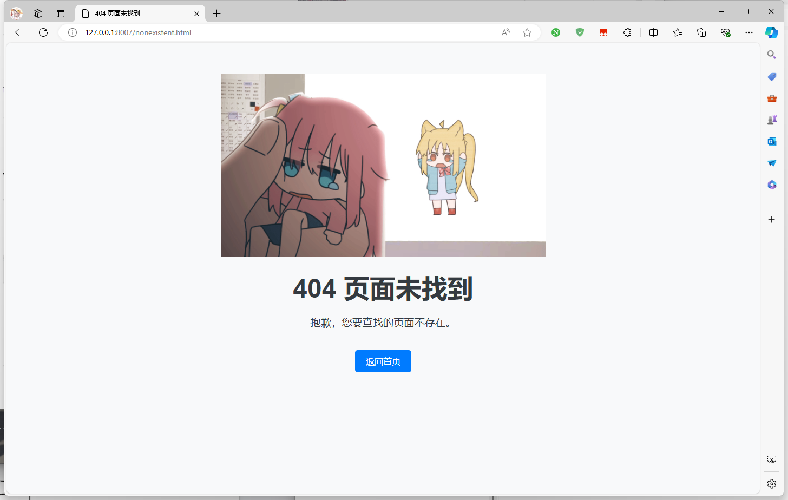


## 三、代码的配置运行


### 1、下载地址

首先给出实例代码的下载地址：[Ciallo～(∠・ω<)⌒★](https://pan.baidu.com/s/1bvs0Orb72ibJu30hC1SJUw?pwd=0721)

**提取码:** 0721


### 2、代码整体

```C
#define _CRT_SECURE_NO_WARNINGS
#define _WINSOCK_DEPRECATED_NO_WARNINGS

#define SERVER_IP_ADDR "0.0.0.0"	//服务器IP地址
#define SERVER_PORT 8007				//服务器端口号
#define BACKLOG 10
#define BUF_SIZE 1024
#define OK 1
#define ERROR 0

#include <direct.h>  // For _getcwd
#include <stdio.h>
#include <stdlib.h>
#include <sys/stat.h> 
#include <time.h>
#include <WinSock2.h>
#pragma comment(lib,"ws2_32.lib")

const char* Server_name = "Server: Web Server 1.0 - BooLo\r\n";
//Web服务器信息 

int Server_Socket_Init(int port);
int Handle_Request_Message(char* message, int Socket);
int Judge_URI(char* URI, int Socket);
int Send_Ifon(int Socket, const char* sendbuf, int Length);
int Error_Request_Method(int Socket);
int Inquire_File(char* URI);
int File_not_Inquire(int Socket);
int Send_File(char* URI, int Socket);
int Logo();
const char* Judge_Method(char* method, int Socket);
const char* Judge_File_Type(char* URI, const char* content_type);
const char* Get_Data(const char* cur_time);
const char* Post_Value(char* message);

int Server_Socket_Init(int port) {
	// 初始化和构造套接字 
	WORD wVersionrequested;
	WSADATA wsaData;
	SOCKET ServerSock;
	struct sockaddr_in ServerAddr;
	int rval;

	/* 加载Winsock */
	wVersionrequested = MAKEWORD(2, 2);
	if (WSAStartup(wVersionrequested, &wsaData) != 0) {
		printf("Failed to load Winsock!\n");
		system("pause");
		return -1;
	}
	printf("Succeed to load Winsock!\n");

	/* 创建套接字 */
	ServerSock = socket(AF_INET, SOCK_STREAM, IPPROTO_TCP);
	if (ServerSock == INVALID_SOCKET) {
		printf("Failed to create socket!\n");
		system("pause");
		exit(1);
	}
	printf("Succeed to create socket!\n");

	/* 配置服务器IP、端口信息 */
	memset(&ServerAddr, 0, sizeof(struct sockaddr));	//每一个字节都用0来填充
	ServerAddr.sin_family = AF_INET;
	ServerAddr.sin_port = htons(port);
	ServerAddr.sin_addr.s_addr = inet_addr(SERVER_IP_ADDR);

	/* 绑定 */
	rval = bind(ServerSock, (SOCKADDR*)&ServerAddr, sizeof(struct sockaddr));
	if (rval == SOCKET_ERROR) {
		printf("Failed to bind stream socket!\n");
		system("pause");
		exit(1);
	}
	printf("Succeed to bind stream socket!\n");

	return ServerSock;
}


int Handle_Request_Message(char* message, int Socket) {
	//处理HTTP请求报文信息 
	int rval = 0;
	char Method[BUF_SIZE];
	char URI[BUF_SIZE];
	char Version[BUF_SIZE];

	if (sscanf(message, "%s %s %s", Method, URI, Version) != 3) {
		printf("Request line error!\n");
		return ERROR;
	} //提取"请求方法"、"URL"、"HTTP版本"三个关键要素 

	if (Judge_Method(Method, Socket) == ERROR) {
		return ERROR;
	}
	else if (Judge_Method(Method, Socket) == "POST") {
		Post_Value(message);
	} //判断处理"请求方法" 

	// 如果URI是根目录，则将其重定向到 /index.html
	if (strcmp(URI, "/") == 0) {
		strcpy(URI, "/index.html");
	}

	if (Judge_URI(URI, Socket) == ERROR) {
		return ERROR;
	} //判断处理"URI" 
	else
		rval = Send_File(URI, Socket);

	if (rval == OK) {
		printf("The process is successfully finished!\n");
	}

	return OK;
}

const char* Judge_Method(char* method, int Socket) {
	//判断请求方式 
	if (strcmp(method, "GET") == 0) {
		return "GET";
	}
	else if (strcmp(method, "POST") == 0) {
		return "POST";
	}
	else {
		Error_Request_Method(Socket);
		return ERROR;
	}
}

int Judge_URI(char* URI, int Socket) {
	//判断请求URI 
	if (Inquire_File(URI) == ERROR) {
		File_not_Inquire(Socket);
		return ERROR;
	}
	else
		return OK;
}

int Send_Ifon(int Socket, const char* sendbuf, int Length) {
	//发送信息到客户端 
	int sendtotal = 0, bufleft, rval = 0;

	bufleft = Length;
	while (sendtotal < Length) {
		rval = send(Socket, sendbuf + sendtotal, bufleft, 0);
		if (rval < 0) {
			break;
		}
		sendtotal += rval;
		bufleft -= rval;
	}

	Length = sendtotal;

	return rval < 0 ? ERROR : OK;
}

int Error_Request_Method(int Socket) {
	//501 Not Implemented响应 
	const char* Method_err_line = "HTTP/1.1 501 Not Implemented\r\n";
	const char* cur_time = "";
	const char* Method_err_type = "Content-type: text/plain\r\n";
	const char* File_err_length = "Content-Length: 41\r\n";
	const char* Method_err_end = "\r\n";
	const char* Method_err_info = "The request method is not yet completed!\n";

	printf("The request method from client's request message is not yet completed!\n");

	if (Send_Ifon(Socket, Method_err_line, strlen(Method_err_line)) == ERROR) {
		printf("Sending method_error_line failed!\n");
		return ERROR;
	}

	if (Send_Ifon(Socket, Server_name, strlen(Server_name)) == ERROR) {
		printf("Sending Server_name failed!\n");
		return ERROR;
	}

	cur_time = Get_Data(cur_time);
	Send_Ifon(Socket, "Data: ", 6);
	if (Send_Ifon(Socket, cur_time, strlen(cur_time)) == ERROR) {
		printf("Sending cur_time error!\n");
		return ERROR;
	}

	if (Send_Ifon(Socket, Method_err_type, strlen(Method_err_type)) == ERROR) {
		printf("Sending method_error_type failed!\n");
		return ERROR;
	}

	if (Send_Ifon(Socket, Method_err_end, strlen(Method_err_end)) == ERROR) {
		printf("Sending method_error_end failed!\n");
		return ERROR;
	}

	if (Send_Ifon(Socket, Method_err_info, strlen(Method_err_info)) == ERROR) {
		printf("Sending method_error_info failed!\n");
		return ERROR;
	}

	return OK;
}

int Inquire_File(char* URI) {
	// Get the current working directory
	char cwd[BUF_SIZE];
	if (_getcwd(cwd, sizeof(cwd)) == NULL) {
		perror("getcwd() error");
		return ERROR;
	}

	// Construct the absolute path
	char abs_path[BUF_SIZE];
	snprintf(abs_path, sizeof(abs_path), "%s%s", cwd, URI);

	struct stat File_info;
	if (stat(abs_path, &File_info) == -1) {
		return ERROR;
	}
	else {
		return OK;
	}
}


int File_not_Inquire(int Socket) {
    const char* File_err_line = "HTTP/1.1 404 Not Found\r\n";
    const char* cur_time = "";
    const char* File_err_type = "Content-type: text/html\r\n";
    const char* File_err_end = "\r\n";

    FILE* file;
    struct stat file_stat;
    char sendbuf[BUF_SIZE];
    int send_length;

    // Get the current working directory
    char cwd[BUF_SIZE];
    if (_getcwd(cwd, sizeof(cwd)) == NULL) {
        perror("getcwd() error");
        return ERROR;
    }

    // Construct the absolute path to 404.html
    char abs_path[BUF_SIZE];
    snprintf(abs_path, sizeof(abs_path), "%s\\404.html", cwd);

    // Open and read 404.html
    file = fopen(abs_path, "rb");
    if (file != NULL) {
        fstat(_fileno(file), &file_stat);

        // Send 404 Not Found response
        if (Send_Ifon(Socket, File_err_line, strlen(File_err_line)) == ERROR) {
            printf("Sending file_error_line error!\n");
            fclose(file);
            return ERROR;
        }

        if (Send_Ifon(Socket, Server_name, strlen(Server_name)) == ERROR) {
            printf("Sending Server_name failed!\n");
            fclose(file);
            return ERROR;
        }

        cur_time = Get_Data(cur_time);
        Send_Ifon(Socket, "Date: ", 6);
        if (Send_Ifon(Socket, cur_time, strlen(cur_time)) == ERROR) {
            printf("Sending cur_time error!\n");
            fclose(file);
            return ERROR;
        }

        if (Send_Ifon(Socket, File_err_type, strlen(File_err_type)) == ERROR) {
            printf("Sending file_error_type error!\n");
            fclose(file);
            return ERROR;
        }

        // Calculate and send Content-Length
        char content_length[BUF_SIZE];
        snprintf(content_length, sizeof(content_length), "Content-Length: %lld\r\n", file_stat.st_size);
        if (Send_Ifon(Socket, content_length, strlen(content_length)) == ERROR) {
            printf("Sending file_error_length error!\n");
            fclose(file);
            return ERROR;
        }

        // Send end of header
        if (Send_Ifon(Socket, File_err_end, strlen(File_err_end)) == ERROR) {
            printf("Sending file_error_end error!\n");
            fclose(file);
            return ERROR;
        }

        // Send 404.html content
        while ((send_length = fread(sendbuf, 1, BUF_SIZE, file)) > 0) {
            if (Send_Ifon(Socket, sendbuf, send_length) == ERROR) {
                printf("Sending 404.html content error!\n");
                break;
            }
        }

        fclose(file);
    } else {
        printf("Failed to open 404.html!\n");
        return ERROR;
    }

    return OK;
}


int Send_File(char* URI, int Socket) {
	char cwd[BUF_SIZE];
	if (_getcwd(cwd, sizeof(cwd)) == NULL) {
		perror("getcwd() error");
		return ERROR;
	}

	char abs_path[BUF_SIZE];
	snprintf(abs_path, sizeof(abs_path), "%s%s", cwd, URI);

	// 200 OK响应
	const char* File_ok_line = "HTTP/1.1 200 OK\r\n";
	const char* cur_time = "";
	const char* File_ok_type = "";
	const char* File_ok_length = "Content-Length: ";
	const char* File_ok_end = "\r\n";

	FILE* file;
	struct stat file_stat;
	char Length[BUF_SIZE];
	char sendbuf[BUF_SIZE];
	int send_length;

	if (Judge_File_Type(abs_path, File_ok_type) == ERROR) {
		printf("The request file's type from client's request message is error!\n");
		return ERROR;
	}

	file = fopen(abs_path, "rb");
	if (file != NULL) {
		fstat(_fileno(file), &file_stat);
		_itoa(file_stat.st_size, Length, 10);

		if (Send_Ifon(Socket, File_ok_line, strlen(File_ok_line)) == ERROR) {
			printf("Sending file_ok_line error!\n");
			return ERROR;
		}

		if (Send_Ifon(Socket, Server_name, strlen(Server_name)) == ERROR) {
			printf("Sending Server_name failed!\n");
			return ERROR;
		}

		cur_time = Get_Data(cur_time);
		Send_Ifon(Socket, "Date: ", 6);
		if (Send_Ifon(Socket, cur_time, strlen(cur_time)) == ERROR) {
			printf("Sending cur_time error!\n");
			return ERROR;
		}

		File_ok_type = Judge_File_Type(abs_path, File_ok_type);
		if (Send_Ifon(Socket, File_ok_type, strlen(File_ok_type)) == ERROR) {
			printf("Sending file_ok_type error!\n");
			return ERROR;
		}

		if (Send_Ifon(Socket, File_ok_length, strlen(File_ok_length)) != ERROR) {
			if (Send_Ifon(Socket, Length, strlen(Length)) != ERROR) {
				if (Send_Ifon(Socket, "\n", 1) == ERROR) {
					printf("Sending file_ok_length error!\n");
					return ERROR;
				}
			}
		}

		if (Send_Ifon(Socket, File_ok_end, strlen(File_ok_end)) == ERROR) {
			printf("Sending file_ok_end error!\n");
			return ERROR;
		}

		while (file_stat.st_size > 0) {
			if (file_stat.st_size < 1024) {
				send_length = fread(sendbuf, 1, file_stat.st_size, file);
				if (Send_Ifon(Socket, sendbuf, send_length) == ERROR) {
					printf("Sending file information error!\n");
					continue;
				}
				file_stat.st_size = 0;
			}
			else {
				send_length = fread(sendbuf, 1, 1024, file);
				if (Send_Ifon(Socket, sendbuf, send_length) == ERROR) {
					printf("Sending file information error!\n");
					continue;
				}
				file_stat.st_size -= 1024;
			}
		}
	}
	else {
		printf("The file is NULL!\n");
		return ERROR;
	}

	return OK;
}


const char* Judge_File_Type(char* URI, const char* content_type) {
	//文件类型判断 
	const char* suffix;

	if ((suffix = strrchr(URI, '.')) != NULL)
		suffix = suffix + 1;

	if (strcmp(suffix, "html") == 0) {
		return content_type = "Content-type: text/html\r\n";
	}
	else if (strcmp(suffix, "jpg") == 0) {
		return content_type = "Content-type: image/jpg\r\n";
	}
	else if (strcmp(suffix, "png") == 0) {
		return content_type = "Content-type: image/png\r\n";
	}
	else if (strcmp(suffix, "gif") == 0) {
		return content_type = "Content-type: image/gif\r\n";
	}
	else if (strcmp(suffix, "txt") == 0) {
		return content_type = "Content-type: text/plain\r\n";
	}
	else if (strcmp(suffix, "xml") == 0) {
		return content_type = "Content-type: text/xml\r\n";
	}
	else if (strcmp(suffix, "rtf") == 0) {
		return content_type = "Content-type: text/rtf\r\n";
	}
	else if (strcmp(suffix, "js") == 0) {  // 添加对js文件的支持
		return content_type = "Content-type: application/javascript\r\n";
	}
	else if (strcmp(suffix, "css") == 0) {  // 添加对css文件的支持
		return content_type = "Content-type: text/css\r\n";
	}
	else if (strstr(URI, ".mp3") != NULL) {
		content_type = "Content-Type: audio/mpeg\r\n";
	}
	else
		return ERROR;
}

const char* Get_Data(const char* cur_time) {
	//获取Web服务器的当前时间作为响应时间 
	time_t curtime;
	time(&curtime);
	cur_time = ctime(&curtime);

	return cur_time;
}

const char* Post_Value(char* message) {
	//获取客户端POST请求方式的值 
	const char* suffix;

	if ((suffix = strrchr(message, '\n')) != NULL)
		suffix = suffix + 1;
	printf("\n\nPost Value: %s\n\n", suffix);

	return suffix;
}

int Logo() {
	//Web服务器标志信息 
	printf("／￣￣￣￣￣￣￣￣￣\n");
	printf("|　　程序启动了！\n");
	printf("＼\n");
	printf("　￣￣∨￣￣￣￣￣￣\n");
	printf("　 ∧＿∧\n");
	printf("　(　∧_∧)　\n");
	printf("　(　 つつヾ\n");
	printf("　 | ｜ |\n");
	printf("　(＿_)＿)\n");
	printf("\n");
	printf("___________________________________________________________\n\n");

	return OK;
}

int main(int argc, char* argv[]) {
	// 默认端口号
	int port = SERVER_PORT;

	// 如果通过命令行传入端口号，则使用该端口号
	if (argc == 2) {
		port = atoi(argv[1]);
	}

	// 初始化服务器套接字
	SOCKET ServerSock, MessageSock;
	struct sockaddr_in ClientAddr;
	int rval, Length;
	char revbuf[BUF_SIZE];

	Logo();
	printf("Web Server is starting on port %d...\n\n", port);
	ServerSock = Server_Socket_Init(port);
	printf("\n-----------------------------------------------------------\n");

	while (OK) {
		/* 启动监听 */
		rval = listen(ServerSock, BACKLOG);
		if (rval == SOCKET_ERROR) {
			printf("Failed to listen socket!\n");
			system("pause");
			exit(1);
		}
		printf("Listening the socket on port %d...\n", port);

		/* 接受客户端请求建立连接 */
		Length = sizeof(struct sockaddr);
		MessageSock = accept(ServerSock, (SOCKADDR*)&ClientAddr, &Length);
		if (MessageSock == INVALID_SOCKET) {
			printf("Failed to accept connection from client!\n");
			system("pause");
			exit(1);
		}
		printf("Succeed to accept connection from [%s:%d] !\n\n", inet_ntoa(ClientAddr.sin_addr), ntohs(ClientAddr.sin_port));

		/* 接收客户端请求数据 */
		memset(revbuf, 0, BUF_SIZE);	//每一个字节都用0来填充 
		rval = recv(MessageSock, revbuf, BUF_SIZE, 0);
		revbuf[rval] = 0x00;
		if (rval <= 0)
			printf("Failed to receive request message from client!\n");
		else {
			printf("%s\n", revbuf);	//输出请求数据内容
			rval = Handle_Request_Message(revbuf, MessageSock);
		}

		closesocket(MessageSock);
		printf("\n-----------------------------------------------------------\n");
	}

	closesocket(ServerSock);	//关闭套接字 
	WSACleanup();	//停止Winsock

	return OK;
}
```


### 3、代码配置

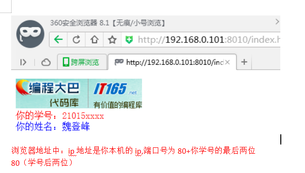

因为根据任务书要求，每个人的代码要有自己的信息，下面将教大家如何更改代码的一些内容然后变为自己的课设！

#### （1）如何更改端口？

将整体代码的**第5行**更改为自己的端口号，为下面我注释的地方

```C
#define _CRT_SECURE_NO_WARNINGS
#define _WINSOCK_DEPRECATED_NO_WARNINGS

#define SERVER_IP_ADDR "0.0.0.0"	
#define SERVER_PORT 8007	// --》 请更改为你自己的端口		
#define BACKLOG 10
#define BUF_SIZE 1024
#define OK 1
#define ERROR 0

```

#### （2）如何更改姓名？

请**解压**上面下载地址的压缩包，然后进入解压后的文件夹，并且点击**keshe**这个文件夹

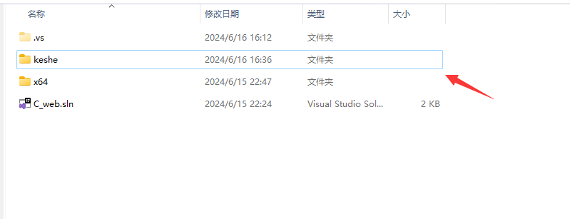

**注： 解压不会的请看下面教程**

本人非常推荐7zip，当然你也可以用自己电脑内置的解压

[【分享】7-Zip解压缩软件的超详细使用攻略_7zip使用教程-CSDN博客](https://blog.csdn.net/Chinland/article/details/130493310)


鼠标右键点开这个**index.html**，并且选择用**文本编辑器**进行打开，你可以使用**vscode**，也可以用**notepad++**，因为大部分人可能没有，所以我教你们用windows内置的**记事本**打开

**请依次按照我的箭头点击！！！**

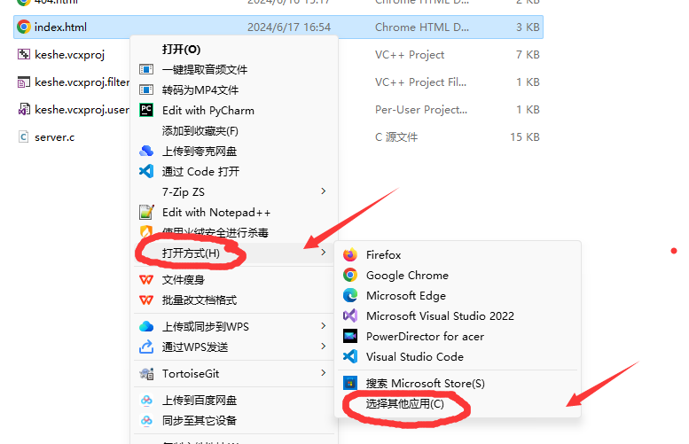

会弹出下面的窗口，如果你已经看到了电脑的**记事本**你就直接点击并且点击下面的**仅一次**，如果**出现我下面的情况没有看到**，请**滑动鼠标滚轮**查找

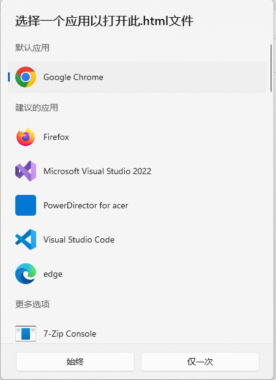

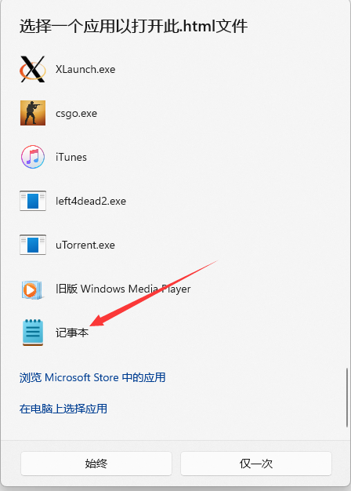

点击下面右边的**仅一次**即可进入记事本界面，可以修改html代码了！

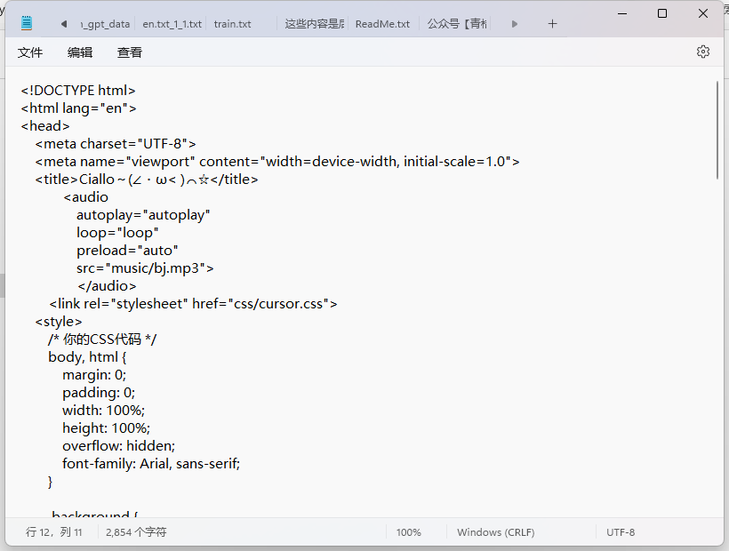

然后请把文本用滚轮**翻到最底部**，也就是**出现中文**的地方！！！

然后修改**你的姓名**这段内容，然后就可以变成你的名字了

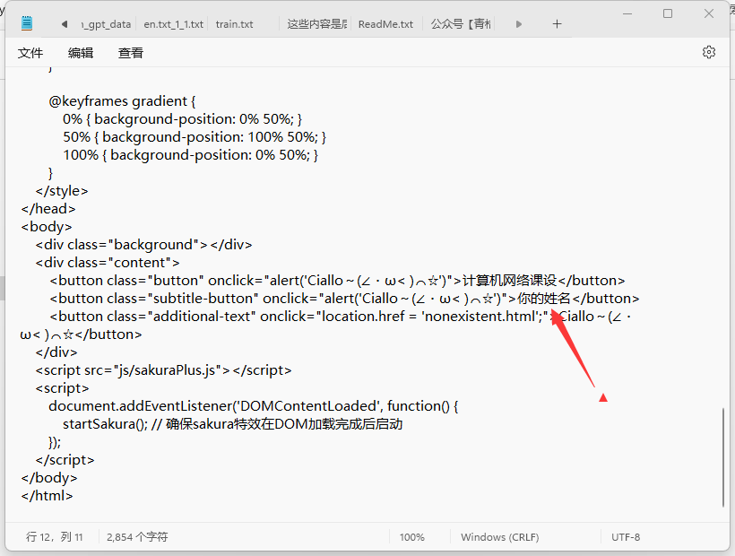

#### （3）额外配置 （可选）


**3.1、如何更改背景音乐并且生效**？

修改**keshe**文件夹下（就是刚刚存储index.html的目录）**music文件夹**里面的mp3文件，mp3可以更换你喜欢的音乐

一个是**404页面的背景音乐**，一个是**主页的背景音乐**

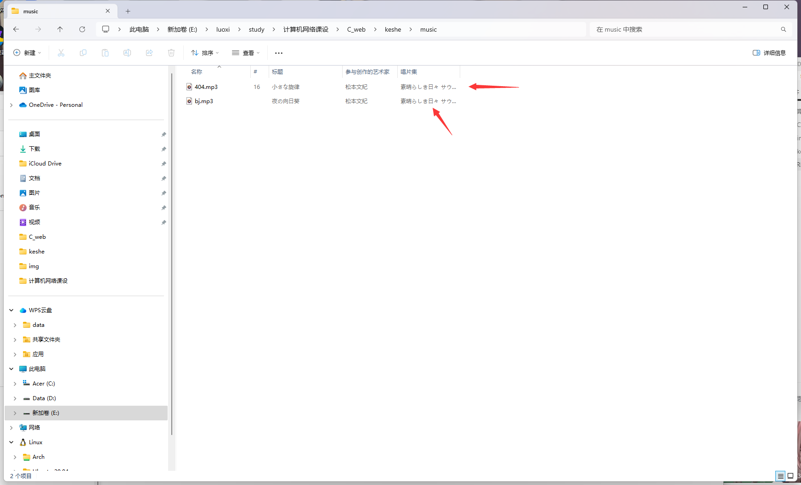

因为我这个是弄的打开页面**自动播放**，如果你用的edge浏览器请打开**媒体自动播放**

请参考右边的链接教程：[如何使用edge浏览器开启网站的媒体自动播放权限-百度经验 (baidu.com)](https://jingyan.baidu.com/article/cbf0e500f635556fab28934c.html)


**3.2、如何更改背景图和404图并且生效？**

修改**keshe**文件夹下（就是刚刚存储index.html的目录）**img文件夹**里面的gif文件，使用gif图片是因为有动态效果，但是网页加载就会很卡，如果你想使用其他的背景图，如**jpg**和**png**都行，不过还是要回到前面更改**index.html**步骤进行更改对应的文件名称

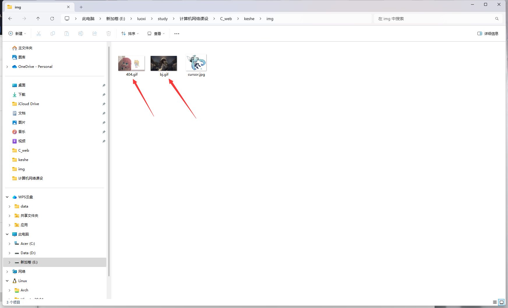

如果更改了图片的名称和格式，请重新按照**（2）如何更改姓名**的步骤打开**index.html**文件和**404.html**，然后更改

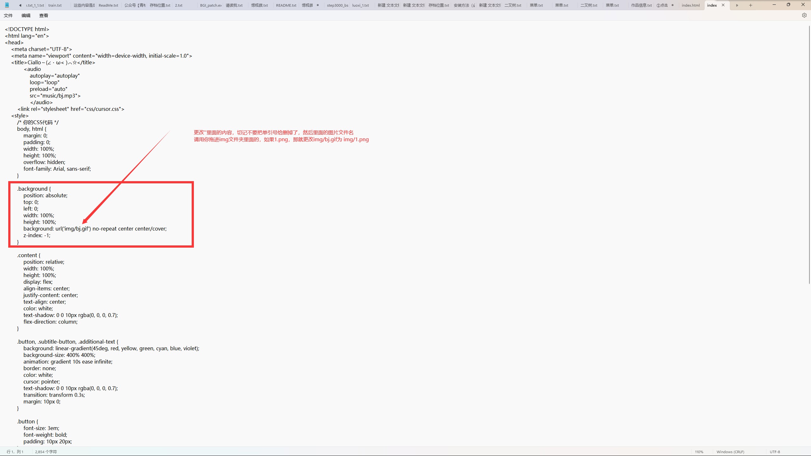

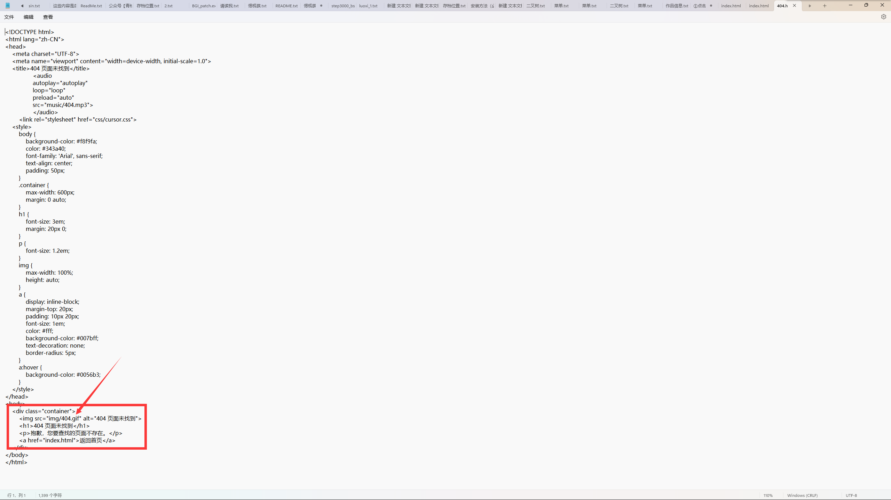


### 4、代码运行

先提前装好**visual studio 2022**环境，具体教程可以看看下面

[编程小白必看！Visual Studio 2022详细安装使用教程（C/C++编译器）-CSDN博客](https://blog.csdn.net/m0_68662723/article/details/132219122)

然后点击解压好文件下面的**C_web.sln**然后将会进入IDE

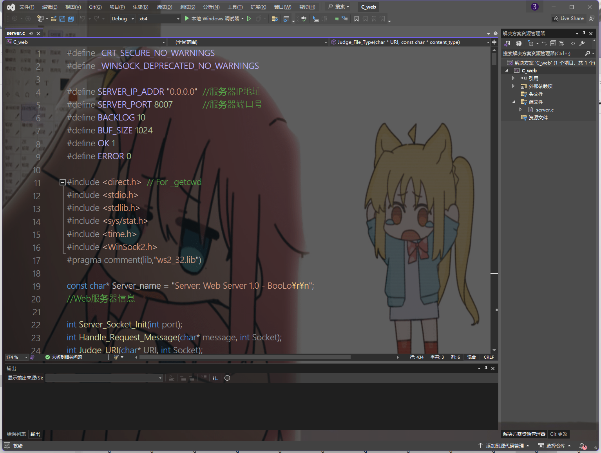

同时按下键盘的**CTRL和F5**然后就会运行项目

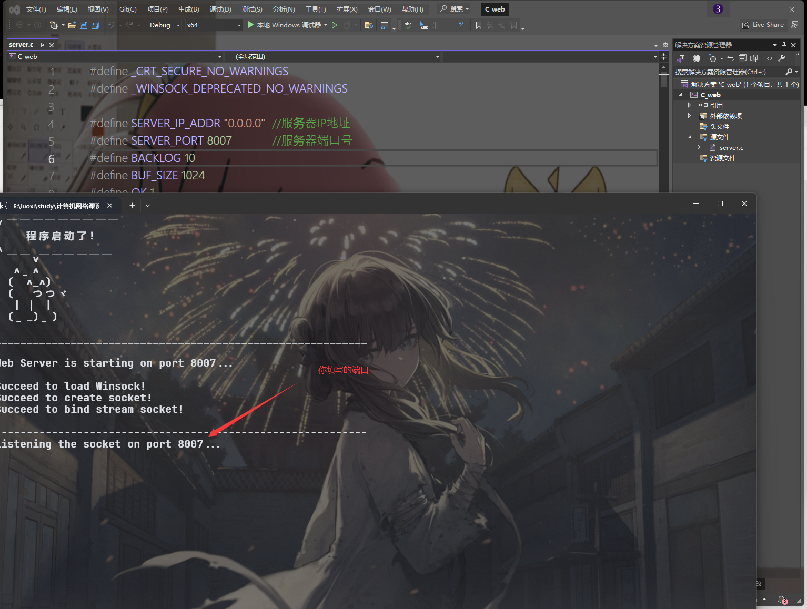

然后打开**Edge浏览器**或者什么其他浏览器都行

输入下面的地址，然后回车

```html
127.0.0.1:{你输入的端口号}
```

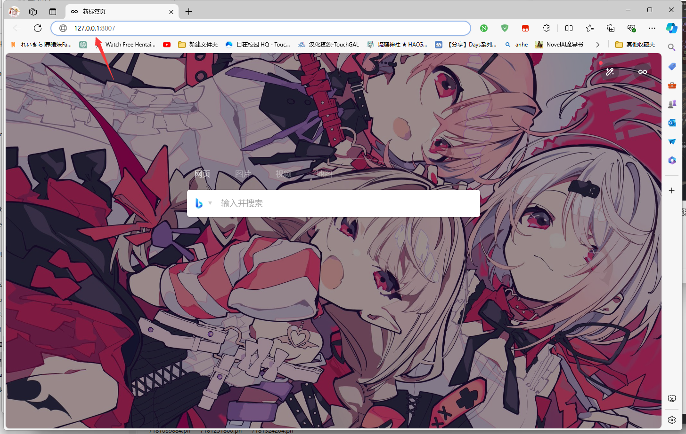


中间的三个文字也是**按钮**，如果点击**计算机网络课设**和**你的姓名**将会弹出Ciallo～(∠・ω<)⌒★，如果点击**Ciallo～(∠・ω<)⌒★**这个按钮的话将会进入**404报错页面**

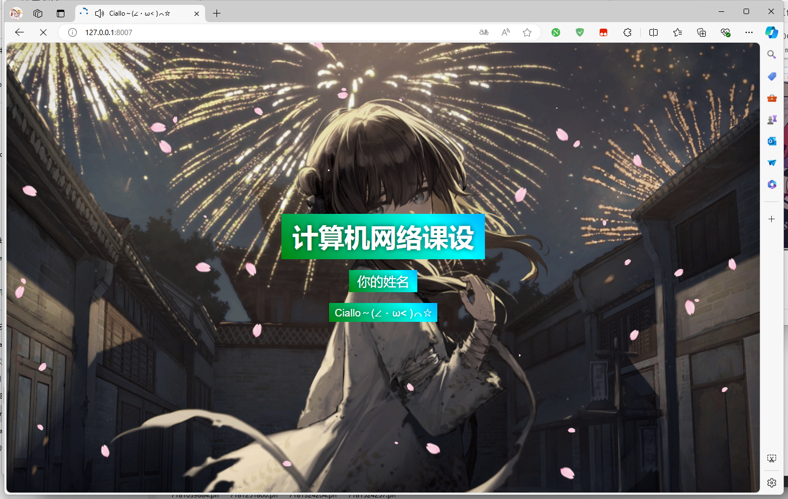

